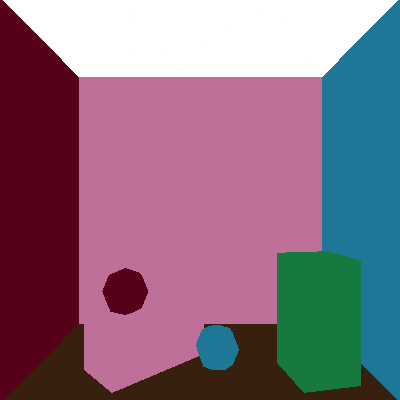

# Three.js Ray Tracer  

This is a Ray Tracer implemented using Three.js without WebGL. The rendering process occurs entirely on the CPU, making it significantly slower than WebGL rendering. WebGL is only used for the preview window on the right.  

## Features

### GUI 

<p align="center">
    
</p>

### Basics  
- Adjust image resolution dynamically via the GUI (```Width``` and ```Height```).  
- Save rendered images as PNG files (```Save```).

<p align="center">
    
</p>

### Intersection  
- The scene contains spheres that are initially poorly sampled.  
- By enabling the ```Correct Spheres``` checkbox, a more accurate intersection calculation is used, replacing the triangle-based ray intersection with a proper parametric ray-sphere intersection.  

<p align="center">
    
</p>

### Illumination  
- Checking ```Phong``` the Phong shading model with light attenuation at each intersection point.  
- The ```All Lights``` option allows multiple light sources to be considered simultaneously.  

<p align="center">
  
  
</p>

### Shadows  
- Shadows are calculated by checking if an object obstructs the path between a light source and an intersection point (```Shadows```).  

<p align="center">
    
</p>

### Mirrors  
- If ```Mirrors``` is enabled, reflective surfaces spawn new rays according to the reflection direction. The resulting color is determined by a blend of Phong illumination and reflection color, weighted by the material's reflectivity.  
- Reflection is implemented recursively, with a configurable ```Max Recursions``` via a GUI slider.  

<p align="center">
    
</p>

### Supersampling (Anti-Aliasing)  
- To reduce aliasing, supersampling is implemented. Then Multiple rays per pixel are cast, and the resulting colors are averaged. The number of rays per pixel is determined by an adjustable root value in ```Subsamples``` (**e.g.,** `2` means `2^2 = 4` rays). Additional rays are distributed on a grid within each pixel. 

<p align="center">
    
</p>